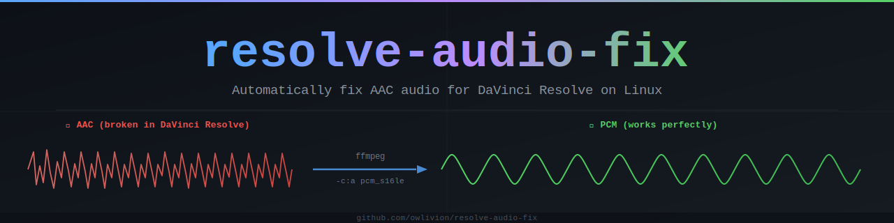

<div align="center">



# resolve-audio-fix

**DaVinci Resolve on Linux silently drops AAC audio.**
This tool fixes it — automatically.

[](LICENSE)
[](#requirements)
[](#)
[](https://github.com/owlivion/resolve-audio-fix/actions/workflows/ci.yml)
[](#trust--security)
[](#trust--security)
[](CONTRIBUTING.md)
[](https://github.com/owlivion/resolve-audio-fix)

</div>

---

## The Problem

DaVinci Resolve on **Linux does not support AAC audio** — the codec used by most cameras, phones, and downloaded videos. The file imports silently, the timeline looks fine, but **there is no sound**.

On Windows and macOS, the operating system provides AAC decoding at the system level. On Linux, no such layer exists, and Blackmagic Design has not bundled an alternative. This has been a known limitation since DaVinci Resolve 16 with no official fix in sight.

## The Solution

`resolve-audio-fix` watches your directories for new video files. When a file with AAC audio is detected, it automatically re-encodes the audio stream to **PCM** (uncompressed, fully supported by DaVinci Resolve) while **copying the video stream without re-encoding** — zero quality loss, fast conversion.

```
your_video.mp4          →    your_video_dr.mov
[H.264 + AAC]                [H.264 + PCM]
 ✗ silent in DR               ✓ works perfectly
```

---

## Features

- **Automatic** — watches your chosen directories in the background via systemd
- **Smart detection** — checks the actual audio codec, skips files that don't need conversion
- **Lossless video** — video stream is copied directly, no re-encoding, no quality loss
- **Non-destructive** — original file is kept by default
- **Nautilus integration** — right-click any video → *Scripts* → *DR Audio Fix*
- **Manual mode** — run `dr-convert.sh` directly on any file or batch of files
- **Desktop notifications** — get notified when conversion starts and finishes
- **Configurable** — choose watched directories, output format (MOV/MKV), and more
- **Lightweight** — pure Bash, no runtime dependencies beyond `ffmpeg` and `inotify-tools`

---

## Requirements

| Tool | Purpose |
|------|---------|
| `ffmpeg` + `ffprobe` | Audio detection and conversion |
| `inotify-tools` | Directory watching |
| `libnotify-bin` | Desktop notifications *(optional)* |
| `nautilus` | Right-click integration *(optional)* |

> The installer can automatically install missing dependencies on Debian/Ubuntu-based systems.

---

## Quick Start

```bash
git clone https://github.com/owlivion-tech/davinci-resolve-audio-fix.git
cd davinci-resolve-audio-fix
bash install.sh
```

That's it. The watcher starts immediately and runs automatically on every login.

---

## Installation

### Option A — .deb package (easiest)

```bash
# Download
wget https://github.com/owlivion-tech/davinci-resolve-audio-fix/releases/latest/download/davinci-resolve-audio-fix_1.0.0_all.deb

# Install
sudo dpkg -i davinci-resolve-audio-fix_1.0.0_all.deb

# Install missing dependencies if needed
sudo apt-get install -f
```

### Option B — Git clone (recommended)

```bash
git clone https://github.com/owlivion-tech/davinci-resolve-audio-fix.git
cd davinci-resolve-audio-fix
bash verify.sh    # optional: audit before installing
bash install.sh
```

### Option B — Verified release download

Download and verify the signed release before installing:

```bash
# 1. Import the maintainer's GPG key
gpg --keyserver keyserver.ubuntu.com --recv-keys 8825D82CA0432A66

# 2. Download release assets
gh release download v1.0.0 \
  --repo owlivion-tech/davinci-resolve-audio-fix

# 3. Verify GPG signature
gpg --verify checksums.sha256.sig checksums.sha256

# 4. Verify file integrity
sha256sum -c checksums.sha256

# 5. Install
bash install.sh
```

Expected output after steps 3 and 4:
```
gpg: Good signature from "Berkan Cetinel <owlivion@users.noreply.github.com>"

install.sh:   OK
uninstall.sh: OK
verify.sh:    OK
```

> **GPG Key fingerprint:** `69B8 8481 62DF B3E1 A196 E08F 8825 D82C A043 2A66`

---

### Installer walkthrough

The interactive installer walks you through everything:

```
$ bash install.sh

  resolve-audio-fix — DaVinci Resolve AAC Audio Fix for Linux
  https://github.com/owlivion/resolve-audio-fix

[✓] All dependencies satisfied.

[?] Which directories should be watched for new videos?
    (space-separated, press Enter for default: $HOME/Downloads)
  > /home/user/Downloads /home/user/Videos

[?] Output format? [mov/mkv] (default: mov)
  > mov

[?] Delete original file after conversion? [y/N] (default: no)
  > n

[✓] Config written to ~/.config/resolve-audio-fix/dr-watch.conf
[✓] Scripts installed to ~/.local/bin
[✓] Systemd service enabled and started.
[✓] Nautilus right-click script installed.

[✓] Installation complete!

  Watch dirs : /home/user/Downloads /home/user/Videos
  Output     : <original>_dr.mov
  Config     : ~/.config/resolve-audio-fix/dr-watch.conf
  Logs       : ~/.local/share/resolve-audio-fix/convert.log

  Manual convert : dr-convert.sh <file>
  Service status : systemctl --user status dr-audio-watch
  View logs      : journalctl --user -u dr-audio-watch -f
```

---

## Configuration

Edit `~/.config/resolve-audio-fix/dr-watch.conf`:

```bash
# Directories to watch (space-separated)
# Example: WATCH_DIRS="$HOME/Downloads $HOME/Videos $HOME/Camera"
WATCH_DIRS="$HOME/Downloads"

# Output format: mov (recommended) or mkv
OUTPUT_FORMAT="mov"

# Suffix appended to converted files
# Result: video_dr.mov
OUTPUT_SUFFIX="_dr"

# Delete original file after successful conversion
DELETE_ORIGINAL="false"

# Desktop notifications
NOTIFY="true"
```

After editing, restart the service:

```bash
systemctl --user restart dr-audio-watch
```

---

## Usage

### Watch Mode (automatic)

Files placed in your watched directories are converted automatically.
Drop a camera recording into `~/Downloads` — a `_dr.mov` file appears beside it within seconds.

```
~/Downloads/
├── clip.mp4          ← original (AAC audio, silent in DaVinci Resolve)
└── clip_dr.mov       ← converted (PCM audio, works perfectly)
```

### Manual Conversion

Convert any file directly:

```bash
dr-convert.sh /path/to/video.mp4
```

Batch conversion:

```bash
dr-convert.sh ~/Videos/*.mp4
```

The tool automatically skips files that:
- Don't have AAC audio
- Already have the `_dr` suffix
- Have already been converted (output file exists)

### Nautilus Right-Click

Select one or more video files in Nautilus, right-click, and choose:

> **Scripts → DR Audio Fix**

Conversion runs in the background. A desktop notification appears when complete.

### Service Management

```bash
# Check status
systemctl --user status dr-audio-watch

# View live logs
journalctl --user -u dr-audio-watch -f

# Restart (e.g. after config change)
systemctl --user restart dr-audio-watch

# Stop temporarily
systemctl --user stop dr-audio-watch

# Disable autostart
systemctl --user disable dr-audio-watch
```

### View Conversion Log

```bash
cat ~/.local/share/resolve-audio-fix/convert.log
```

---

## How It Works

```
                    resolve-audio-fix
                          │
          ┌───────────────┼───────────────┐
          │               │               │
   inotifywait       dr-convert.sh    Nautilus
   (watch dirs)      (manual/batch)   (right-click)
          │               │               │
          └───────────────┴───────────────┘
                          │
                   ffprobe (detect)
                          │
                  codec == AAC ?
                    │         │
                   NO        YES
                    │         │
                  SKIP     ffmpeg
                            │
                      -c:v copy          ← video untouched
                      -c:a pcm_s16le     ← audio re-encoded
                            │
                      output_dr.mov
                            │
                   notify-send ✓
```

---

## Supported Input Formats

`mp4` `mov` `mkv` `avi` `mts` `m2ts` `3gp` `flv` `wmv` `mxf`

---

## Troubleshooting

**File was not converted**

Check the log:
```bash
cat ~/.local/share/resolve-audio-fix/convert.log
```

Common reasons:
- Audio is not AAC (the file already works in DaVinci Resolve)
- Output file `_dr.mov` already exists
- File extension is not in the supported list
- `ffmpeg` encountered an error (check log for details)

**Verify the audio codec of any file:**
```bash
ffprobe -v quiet -select_streams a:0 \
  -show_entries stream=codec_name \
  -of csv=p=0 your_file.mp4
```

**Service not starting**
```bash
journalctl --user -u dr-audio-watch -xe
```

**No desktop notifications**
Install `libnotify-bin`:
```bash
sudo apt-get install libnotify-bin
```

---

## Prevent the Problem at the Source

If you control the recording device or software:

**OBS Studio:**
> Settings → Output → Recording → Audio Encoder → `PCM (S16LE)`

**ffmpeg recording:**
```bash
ffmpeg -i input -c:v copy -c:a pcm_s16le output.mov
```

**Camera footage:** If your camera allows codec selection, prefer H.264 + PCM or LPCM audio.

---

## DaVinci Resolve Script

In addition to the background watcher, `resolve-audio-fix` includes a Python script
that runs **directly inside DaVinci Resolve** from the Workspace menu.

### Install

The `install.sh` installer places it automatically if DaVinci Resolve is detected.
To install manually:

```bash
cp resolve_script/dr_audio_fix.py \
   ~/.local/share/DaVinciResolve/Fusion/Scripts/Utility/
```

### Usage

1. Open DaVinci Resolve
2. Navigate to the Media Pool folder containing your clips
3. Go to **Workspace → Scripts → dr_audio_fix**
4. Click **Convert AAC Clips in Current Folder**

The script scans all clips in the current folder, converts any with AAC audio,
and automatically imports the converted files back into the Media Pool.

---

## Trust & Security

`resolve-audio-fix` is designed to be fully auditable.

| Property | Status |
|----------|--------|
| No network calls | Verified by CI on every commit |
| No root/sudo required | Installs to `~/.local/` only |
| No binary blobs | Pure Bash + Python, fully readable |
| No data collection | Zero telemetry |
| ShellCheck clean | Zero warnings |
| Bandit clean | Zero findings |

### Verify before installing

```bash
# 1. Audit the code — shows all install paths and checks for network calls
bash verify.sh

# 2. Preview install without making any changes
bash install.sh --dry-run

# 3. Verify with strace — should show zero network syscalls
strace -e trace=network bash install.sh 2>&1 | grep -v "^---"
```

### Verify a signed release

```bash
# Import maintainer's public GPG key
gpg --keyserver keyserver.ubuntu.com --recv-keys 8825D82CA0432A66

# Verify signature
gpg --verify checksums.sha256.sig checksums.sha256

# Check file integrity
sha256sum -c checksums.sha256
```

**GPG Key:** `69B8 8481 62DF B3E1 A196  E08F 8825 D82C A043 2A66`
**Key owner:** Berkan Cetinel `<owlivion@users.noreply.github.com>`

See [SECURITY.md](SECURITY.md) for the full security policy.

---

## Uninstall

```bash
bash uninstall.sh
```

---

## Contributing

Contributions are welcome! Please read [CONTRIBUTING.md](CONTRIBUTING.md) first.

Common contribution ideas:
- **Thunar integration** (XFCE)
- **Dolphin integration** (KDE)
- **Nemo integration** (Cinnamon)
- **AUR / .deb package**
- Testing on Arch, Fedora, openSUSE

---

## License

[MIT](LICENSE) © [Berkan Cetinel (owlivion)](https://github.com/owlivion)

---

<div align="center">

*Built out of frustration by a Linux user who just wanted to edit video.*
*If this saved you time, consider leaving a ⭐*

</div>
